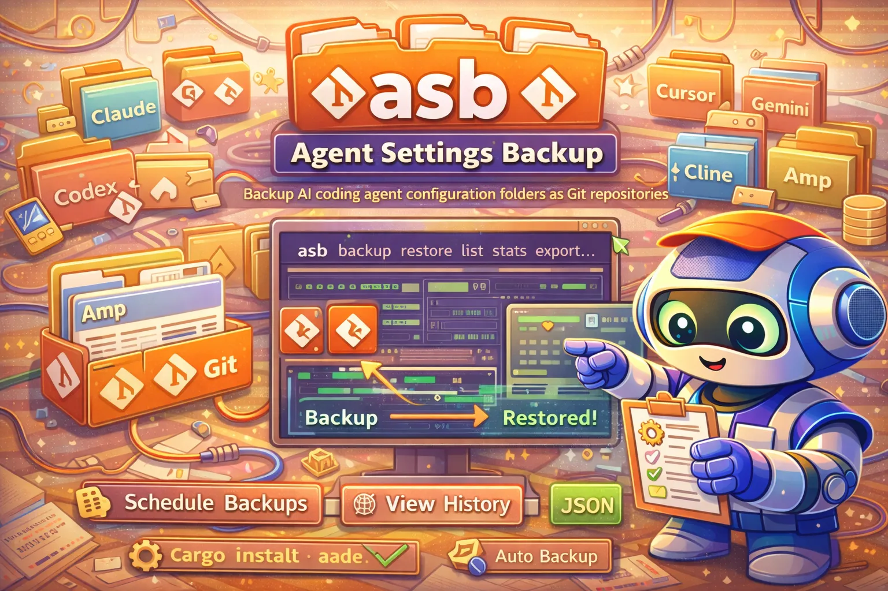

# Agent Settings Backup (asb)

<div align="center">
  
</div>

<div align="center">

[](https://github.com/Dicklesworthstone/agent_settings_backup_script/actions/workflows/test.yml)
[](https://github.com/Dicklesworthstone/agent_settings_backup_script/actions/workflows/release.yml)
[](https://opensource.org/licenses/MIT)

</div>

A smart backup tool for AI coding agent configuration folders. Each agent type gets its own git repository, providing full version history and easy restoration.

<div align="center">
<h3>Quick Install</h3>

```bash
curl -fsSL "https://raw.githubusercontent.com/Dicklesworthstone/agent_settings_backup_script/main/install.sh" | bash
```

</div>

---

## Features

- **Git-versioned backups**: Every backup is a git commit with full history
- **Multiple agent support**: Claude, Codex, Cursor, Gemini, Cline, Amp, Aider, OpenCode, Factory, Windsurf, and more
- **Efficient syncing**: Uses rsync for incremental backups
- **Easy restoration**: Restore to any point in history
- **Diff support**: See what changed since last backup
- **Restore preview & confirmation**: See changes before restoring
- **Config file support**: Persistent settings in `~/.config/asb/config`
- **Export/import archives**: Move backups between machines
- **Shell completion**: Bash, Zsh, and Fish completions
- **Dry-run mode**: Preview operations without changes
- **Scheduled backups**: Install cron or systemd timers with `asb schedule`
- **Hooks**: Run scripts before/after backup and restore
- **Named tags**: Label important backups for easy reference
- **Backup statistics**: See size, commit count, and activity metrics
- **Auto-discovery**: Scan for new AI coding agents
- **JSON output**: Machine-readable output for all commands

## New in v0.3

- **Backup tags**: Name important backups with `asb tag claude v1.0`
- **Restore from tags**: Use `asb restore claude v1.0` instead of commit hashes
- **Statistics**: View backup stats with `asb stats` and `asb stats <agent>`
- **Auto-discovery**: Find new AI agents with `asb discover`
- **Custom agents**: Add discovered agents to your backup rotation
- **JSON output**: All commands support `--json` for machine-readable output

## New in v0.2

- **Dry-run mode**: Preview changes with `--dry-run` or `-n`
- **Restore confirmation**: See exactly what will change before restoring
- **Configuration file**: Persistent settings in `~/.config/asb/config`
- **Export/Import**: Portable archives with `asb export` and `asb import`
- **Shell completion**: Tab completion for bash, zsh, and fish

## Installation

**Or install manually:**

```bash
git clone https://github.com/Dicklesworthstone/agent_settings_backup_script.git
cd agent_settings_backup_script
cp asb ~/.local/bin/
```

### Shell Completion

Enable tab completion for commands and agent names:

```bash
# Bash (~/.bashrc)
eval "$(asb completion bash)"

# Zsh (~/.zshrc)
eval "$(asb completion zsh)"

# Fish (~/.config/fish/config.fish)
asb completion fish | source
```

## Quick Start

```bash
# Initialize backup location
asb init

# Backup all detected agents
asb backup

# Check backup status
asb list
```

## Usage

```bash
asb [options] <command> [args]

Global options:
  -n, --dry-run           Show what would happen without making changes
  -f, --force             Skip confirmation prompts (use with caution)
  -v, --verbose           Show detailed output
  --json                  Output in JSON format (machine-readable)

Commands:
  backup [agents...]        Backup agent settings (all if none specified)
  restore <agent> [commit|tag]  Restore agent from backup (commit or tag name)
  export <agent> [file]     Export backup as portable archive
  import <file>             Import backup from archive
  list                      List all agents and backup status
  history <agent>           Show backup history for an agent
  diff <agent>              Show changes since last backup
  verify [agents...]        Verify backup integrity (all if none specified)
  tag <agent> [name]        Tag a backup (--list, --delete supported)
  stats [agent]             Show backup statistics
  discover                  Scan for new AI agents (--auto, --list)
  schedule [options]        Set up automated scheduled backups
  hooks --list              List configured hooks
  init                      Initialize backup location
  config [init|show]        Manage configuration
  completion [bash|zsh|fish] Output shell completion script
  help                      Show help message
  version                   Show version
```

## Supported Agents

| Agent | Config Folder | Description |
|-------|--------------|-------------|
| `claude` | `~/.claude` | Claude Code |
| `codex` | `~/.codex` | OpenAI Codex CLI |
| `cursor` | `~/.cursor` | Cursor |
| `gemini` | `~/.gemini` | Google Gemini |
| `cline` | `~/.cline` | Cline |
| `amp` | `~/.amp` | Amp (Sourcegraph) |
| `aider` | `~/.aider` | Aider |
| `opencode` | `~/.opencode` | OpenCode |
| `factory` | `~/.factory` | Factory Droid |
| `windsurf` | `~/.windsurf` | Windsurf |
| `plandex` | `~/.plandex-home` | Plandex |
| `qwencode` | `~/.qwen` | Qwen Code |
| `amazonq` | `~/.q` | Amazon Q |

## Examples

### Backup Operations

```bash
# Backup all detected agents
asb backup

# Preview backup without changes
asb --dry-run backup

# Backup specific agents
asb backup claude codex

# Backup with verbose output
ASB_VERBOSE=true asb backup
```

### Restore Operations

```bash
# Restore from latest backup
asb restore claude

# Restore from specific commit
asb restore claude abc1234

# Restore without confirmation (scripting)
asb --force restore claude

# Preview restore without changes
asb --dry-run restore claude

# List available commits first
asb history claude
```

### Viewing History

```bash
# Show backup history
asb history claude

# Show last 50 backups
asb history claude 50

# Show changes since last backup
asb diff claude
```

### Tags

```bash
# Tag current backup
asb tag claude v1.0

# Tag with description
asb tag claude before-refactor

# List all tags
asb tag claude --list

# Restore from tag
asb restore claude v1.0

# Delete a tag
asb tag claude --delete v1.0
```

### Statistics

```bash
# Overview of all agents
asb stats

# Detailed stats for one agent
asb stats claude

# JSON output for scripting
asb --json stats
```

### Discovery

```bash
# List newly found agents
asb discover --list

# Interactively add found agents
asb discover

# Auto-add all found agents
asb discover --auto

# JSON output
asb --json discover --list
```

## Portability

Export backups for transfer between machines:

```bash
asb export claude                    # Create archive
asb export claude my-backup.tar.gz   # Custom filename
asb import claude-backup.tar.gz      # Import on new machine
```

Pipe support for remote transfer or encryption:

```bash
asb export claude - | ssh remote "asb import -"
asb export claude - | gpg -c > backup.gpg
```

## Configuration

asb can be configured via config file or environment variables.

### Config File

```bash
asb config init    # Create config file
asb config show    # View current settings
```

Config file location: `~/.config/asb/config` (XDG-compliant).
Precedence: config file > environment variable > default.

Environment variables:

| Variable | Default | Description |
|----------|---------|-------------|
| `ASB_BACKUP_ROOT` | `~/.agent_settings_backups` | Backup location |
| `ASB_AUTO_COMMIT` | `true` | Auto-commit on backup |
| `ASB_VERBOSE` | `false` | Verbose output |

## Hooks

asb can run user-defined scripts before and after backup/restore operations.

Hook directories (created by `asb config init`):

```
~/.config/asb/hooks/
  pre-backup.d/    # Run before any backup
  post-backup.d/   # Run after successful backup
  pre-restore.d/   # Run before any restore
  post-restore.d/  # Run after successful restore
```

Rules:
- Hooks run in alphabetical order (e.g., `01-*.sh`, `02-*.sh`)
- Scripts must be executable
- Pre-hook failure aborts the operation
- Post-hook failure logs a warning but continues

Environment variables passed to hooks:

| Variable | Description |
|----------|-------------|
| `ASB_AGENT` | Agent name (e.g., `claude`) |
| `ASB_SOURCE` | Source config path (e.g., `~/.claude`) |
| `ASB_BACKUP_DIR` | Backup directory path |
| `ASB_OPERATION` | `backup` or `restore` |
| `ASB_COMMIT` | Commit hash (post-backup) or restore target |

List active hooks:

```bash
asb hooks --list
```

## Backup Structure

```
~/.agent_settings_backups/
├── README.md
├── .claude/           # Git repo with Claude settings history
│   ├── .git/
│   ├── .gitignore
│   ├── settings.json
│   └── ...
├── .codex/            # Git repo with Codex settings history
│   ├── .git/
│   └── ...
└── ...
```

Each agent folder is a complete git repository. You can:
- `cd ~/.agent_settings_backups/.claude && git log` to see history
- `git diff HEAD~1` to see last changes
- `git checkout <commit>` to view old state

## Automation

### Quick Scheduling (Recommended)

Use the built-in scheduler to install cron jobs or systemd timers:

```bash
# Install daily systemd timer
asb schedule --systemd --interval daily

# Install weekly cron job
asb schedule --cron --interval weekly

# Check status or remove
asb schedule --status
asb schedule --remove --systemd
```

### Cron Job

```bash
# Backup daily at midnight
0 0 * * * /home/user/.local/bin/asb backup >> /var/log/asb.log 2>&1
```

### Systemd Timer

```ini
# ~/.config/systemd/user/asb-backup.timer
[Unit]
Description=Daily agent settings backup

[Timer]
OnCalendar=daily
Persistent=true

[Install]
WantedBy=timers.target
```

```ini
# ~/.config/systemd/user/asb-backup.service
[Unit]
Description=Agent Settings Backup

[Service]
Type=oneshot
ExecStart=%h/.local/bin/asb backup
```

```bash
systemctl --user enable asb-backup.timer
systemctl --user start asb-backup.timer
```

## Architecture

```
┌─────────────────────────────────────────────────────────────────┐
│                         User Commands                            │
│   asb backup │ restore │ list │ history │ diff │ export/import  │
└─────────────────────────────────────────────────────────────────┘
                                 │
                                 ▼
┌─────────────────────────────────────────────────────────────────┐
│                          asb CLI                                 │
│  ┌──────────┐  ┌──────────┐  ┌──────────┐  ┌──────────────────┐ │
│  │  Config  │  │  Hooks   │  │  Agent   │  │    Commands      │ │
│  │  Loader  │  │  System  │  │  Detect  │  │ backup/restore/  │ │
│  │          │  │ pre/post │  │          │  │ export/history   │ │
│  └──────────┘  └──────────┘  └──────────┘  └──────────────────┘ │
└─────────────────────────────────────────────────────────────────┘
                                 │
            ┌────────────────────┼────────────────────┐
            ▼                    ▼                    ▼
    ┌──────────────┐    ┌──────────────┐    ┌──────────────┐
    │   ~/.claude  │    │   ~/.codex   │    │   ~/.cursor  │
    │   (source)   │    │   (source)   │    │   (source)   │
    └──────────────┘    └──────────────┘    └──────────────┘
            │                    │                    │
            │      rsync/cp      │                    │
            ▼                    ▼                    ▼
┌─────────────────────────────────────────────────────────────────┐
│              ~/.agent_settings_backups/                          │
│  ┌───────────────┐  ┌───────────────┐  ┌───────────────┐        │
│  │    .claude/   │  │    .codex/    │  │   .cursor/    │  ...   │
│  │  ┌─────────┐  │  │  ┌─────────┐  │  │  ┌─────────┐  │        │
│  │  │  .git/  │  │  │  │  .git/  │  │  │  │  .git/  │  │        │
│  │  │ (repo)  │  │  │  │ (repo)  │  │  │  │ (repo)  │  │        │
│  │  └─────────┘  │  │  └─────────┘  │  │  └─────────┘  │        │
│  │  settings.json│  │  config.yaml  │  │  prefs.json   │        │
│  │  ...         │  │  ...          │  │  ...          │        │
│  └───────────────┘  └───────────────┘  └───────────────┘        │
└─────────────────────────────────────────────────────────────────┘

Configuration: ~/.config/asb/
├── config              # Settings file
├── custom_agents       # User-defined agents
└── hooks/
    ├── pre-backup.d/   # Run before backup
    ├── post-backup.d/  # Run after backup
    ├── pre-restore.d/  # Run before restore
    └── post-restore.d/ # Run after restore
```

## Troubleshooting

### Common Issues

**Backup fails with "no changes to commit"**
This is normal behavior when there are no modifications since the last backup. The backup completes successfully; git just doesn't create a new commit for identical content.

**rsync not found**
asb falls back to `cp` if rsync isn't available. For better performance with large configs, install rsync:
```bash
# Ubuntu/Debian
sudo apt install rsync

# macOS
brew install rsync
```

**Permission denied during restore**
Ensure you have write permissions to the agent config folder. If files are owned by root, use sudo or fix permissions:
```bash
sudo chown -R $USER ~/.claude
```

**Git "dubious ownership" error**
This occurs when the backup directory is owned by a different user. Fix ownership or configure git:
```bash
# Fix ownership
chown -R $USER ~/.agent_settings_backups

# Or add safe directory (less secure)
git config --global --add safe.directory ~/.agent_settings_backups/.claude
```

**Schedule not running**
- For cron: Check `crontab -l` and verify the cron daemon is running
- For systemd: Check status with `systemctl --user status asb-backup.timer`
- Check logs: `journalctl --user -u asb-backup.service`

**Export fails with "no backup exists"**
Run `asb backup <agent>` first to create the initial backup before exporting.

**Large backup size**
Certain agents store cache files or large binary data. Add exclusions to `.gitignore`:
```bash
echo "*.cache" >> ~/.agent_settings_backups/.claude/.gitignore
echo "cache/" >> ~/.agent_settings_backups/.claude/.gitignore
git -C ~/.agent_settings_backups/.claude add .gitignore
git -C ~/.agent_settings_backups/.claude commit -m "Add cache exclusions"
```

### Debug Mode

For detailed output, enable verbose mode:
```bash
ASB_VERBOSE=true asb backup claude
```

Or use dry-run to see what would happen without making changes:
```bash
asb --dry-run backup claude
asb --dry-run restore claude
```

### Getting Help

- Check existing issues: [GitHub Issues](https://github.com/Dicklesworthstone/agent_settings_backup_script/issues)
- Report bugs with debug output: `ASB_VERBOSE=true asb <command> 2>&1`

## Requirements

- `git` (required)
- `rsync` (recommended, falls back to `cp`)
- `curl` or `wget` (for installation)

## License

MIT

## Related Projects

- [repo_updater](https://github.com/Dicklesworthstone/repo_updater) - Multi-repo management tool
- [coding_agent_session_search (cass)](https://github.com/Dicklesworthstone/coding_agent_session_search) - Search agent session histories
- [mcp_agent_mail](https://github.com/Dicklesworthstone/mcp_agent_mail) - Agent coordination via MCP
